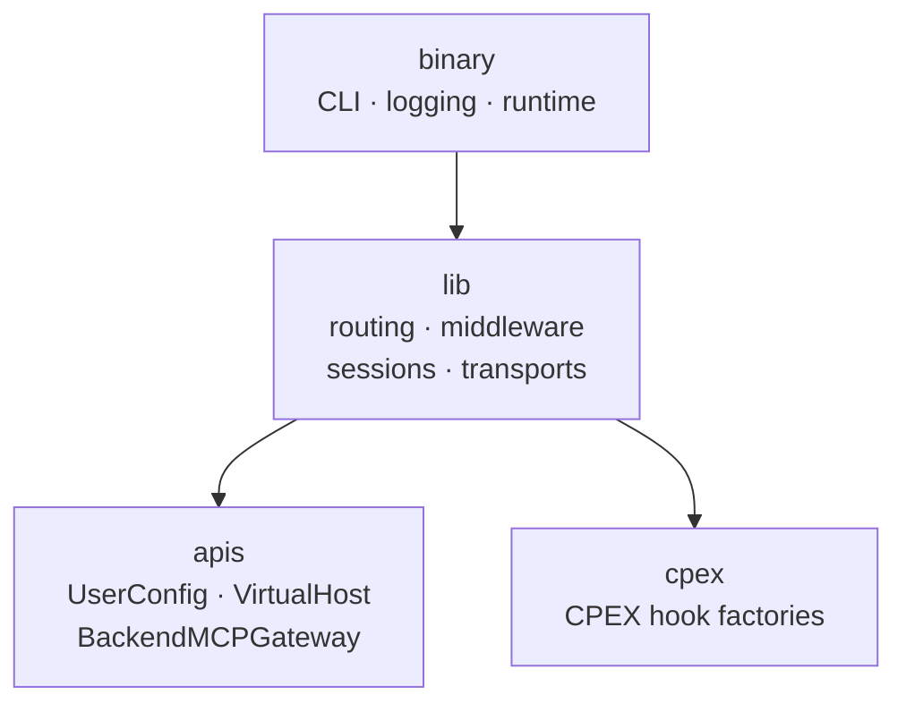
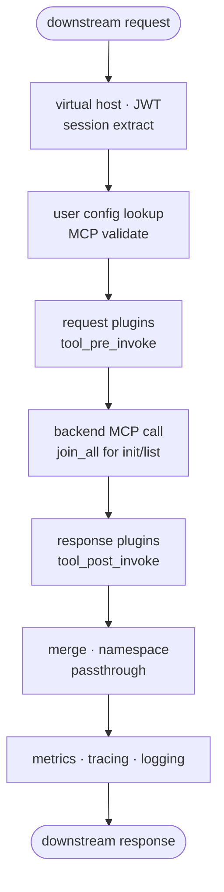

# Architecture

> This page describes the **current Rust implementation**, including temporary
> backend fan-out and session behavior. The tentative configuration-driven end
> state is in
> [ContextForge 2.0 Target Architecture and Roadmap](mcp-capability-allocation.md).

## Middleware Stack Order

Tower layers execute outside-in. A request reaches MCP handlers with these extensions already set:

```text
TCP/TLS listener
  -> HttpMetricsLayer
  -> TraceLayer
  -> /contextforge-rs nested router
  -> mcp_origin_layer          → validates Origin                 (403 when invalid/disallowed)
  -> CORS layer
  -> mcp_header_limits_layer   → MCP standard header budgets      (431 when exceeded)
  -> virtual_host_id_layer       → inserts VirtualHostId           (400 on path mismatch)
  -> claims_layer                → inserts ContextForgeClaims      (401 on bad/missing JWT)
  -> session_id_layer            → inserts SessionId if present
  -> user_config_store_layer     → inserts UserConfig              (400 no config, 500 store error)
  -> virtual_host_config_layer   → rejects unknown vhost           (404 "Server not found")
  -> /servers/{virtual_host_name}/mcp RMCP service → validates Host, then dispatches MCP
```

DNS-rebinding validation is split by behavior. `mcp_origin_layer` rejects any
present Origin that is malformed or not allowlisted; requests without Origin
continue. RMCP validates the optional Host allowlist at the MCP service
boundary. See [Security](security.md#mcp-origin-and-host-validation).
`mcp_header_limits_layer` rejects excessive MCP standard headers before JWT
validation, config lookup, session creation, backend fanout, or RMCP body
parsing.

MCP handlers read typed extensions — they never parse headers, paths, or Redis keys directly.

## Pipeline Shape

```text
downstream request
  -> Origin validation → MCP header limits → virtual host extraction → JWT validation → session extraction
  -> user config lookup → RMCP Host validation → MCP handler validation
  -> request plugin hooks
  -> backend MCP call (concurrent via join_all for initialize/list)

upstream response
  -> response plugin hooks → merge/namespace/passthrough
  -> metrics, tracing, logging → downstream response
```



**Hot-path pipeline** (each stage must complete before the next):




Order is invariant: auth/config before backend selection; request plugins before upstream; response plugins before returning.

## Module Boundaries (`contextforge-data-plane-lib`)

| Module | Owns |
| --- | --- |
| `common.rs` | CLI config shape, JWT claims, Redis config validation, `reqwest::Client` construction |
| `layers/` | HTTP request extension extraction, request-bound validation |
| `gateway/` | MCP server behavior, initialize fanout, list merging, prefixed routing, backend service state |
| `gateway/session_store/` | Local and Redis user session storage |
| `user_config_store/` | `UserConfigStore` trait, Redis-backed store |
| `transports/` | Downstream TCP and TLS listener setup |
| `tools.rs` | Local bootstrap helpers (`with_tools` feature only) |

## State Ownership

| State | Owner | Lifetime |
| --- | --- | --- |
| CLI `Config` | Binary startup + `Gateway` | Process |
| JWT decoders | `ContextForgeDataPlaneAppState` | Process |
| User config | `RedisUserConfigStore` (LRU + Redis) | Request-path consumed; control-plane authored |
| Request identity / VirtualHostId | Request extensions | One HTTP request |
| Downstream session id | RMCP + `SessionId` extension | MCP session |
| Backend RMCP services (initialize, list ops) | `BackendTransports` map | Local process, per principal/backend/session |
| Backend RMCP services (call_tool) | Per-request connection | Single HTTP request |
| Local user session mapping | `LocalUserSessionStore` | Local LRU, 50k entries, 1 hour |
| Plugin manager | `CpexRuntimeRegistry` | Process, reloadable |

> **Session rule:** backend MCP services are local process state. Sticky routing required for load-balanced deployments.

## Executor Shapes

| `--single-runtime` | Shape |
| --- | --- |
| `true` (default) | One multi-thread Tokio runtime, `--number-of-cpus` workers. All connections share one `BackendTransports`. |
| `false` | One OS thread per CPU, each with its own current-thread Tokio runtime and own `BackendTransports`. `SO_REUSEPORT` spreads connections — no session affinity. **Stateful MCP sessions need `--single-runtime true`**. |

In multi-runtime mode, the first thread initializes the optional CPEX plugin runtime before the others start; the current-thread builders are tuned with a global queue interval of `1024` and `4` I/O events per tick.

> **Multi-runtime consequence:** each runtime thread builds its own `BackendTransports` map and user-session store. Backend session state is per-runtime-thread, and `SO_REUSEPORT` gives no connection affinity — later requests in a streamable HTTP session can land on a thread that does not own the session. Treat single-runtime as the only mode supporting stateful MCP sessions today.

## Lock Design

| State | Lock | Contention profile |
| --- | --- | --- |
| `BackendTransports` map | `Arc<tokio::sync::Mutex<HashMap<...>>>` | Locked briefly on initialize insert, list-op borrow, and cleanup. Borrowing clones `Arc<RunningService>` handles so the lock is not held across backend calls. `call_tool` bypasses this map entirely. |
| Subscription set | `Arc<tokio::sync::Mutex<HashSet<String>>>` | Local `subscribe`/`unsubscribe` only. |
| User config LRU cache | `Arc<tokio::sync::Mutex<LruCache>>` inside `RedisUserConfigStore` | One lock per config lookup on the hot path; misses add a Redis round trip. |
| User session LRU cache | Same pattern in `LocalUserSessionStore` | Initialize and delete paths. |
| JWT decoders, upstream `reqwest::Client`, process `Config` | No lock — immutable after startup, shared by `Arc`/clone. | None. |

Design rule: locks guard maps of handles, not I/O. Backend calls, Redis reads, and plugin hooks all run outside any gateway lock.

## Listener Behavior

The TCP listener binds with `reuseaddr`, `reuseport`, and keepalive, listens with a backlog of `1024`, and serves Axum with graceful shutdown on `ctrl_c`. The TLS listener accepts by hand through Rustls and serves the same router via Hyper.

## Allocator

The binary sets `tikv_jemallocator` as the global allocator. jemalloc holds up better than the system allocator under the many small, short-lived allocations of per-request JSON and header processing.

## Fanout And Cancellation

- `initialize` opens one backend transport per configured backend concurrently (`futures::future::join_all`); a failed backend degrades that backend only.
- List methods fan out to all connected backends concurrently and merge.
- Targeted calls (except `call_tool`) resolve exactly one backend service handle from `BackendTransports`.
- `call_tool` creates a fresh per-request backend connection via `connect_backend_for_request`, runs pre/post plugin hooks, executes the call, then explicitly closes the connection before returning.
- `call_tool` watches the downstream cancellation token and forwards a cancel to the backend if the client gives up first; backend progress notifications are forwarded downstream while the call is in flight.

## Startup And Response Flow

Startup sequence (`main.rs` → `Gateway::run_gateway`):

```text
install rustls crypto provider
  -> Config::parse()
  -> logging::init_tracing_logging(&config)
  -> Runtime::from(&config)          ← sets executor shape
  -> optional CpexRuntimeRegistry
  -> Gateway::builder()
       .with_config(config)
       .with_user_config_store_type(UserConfigStoreType::Redis)
       .with_session_manager(LocalSessionManager::default())
       .with_plugin_runtime(...)
       .build()
  -> runtime.execute(gateway, plugin_registry)
```

Response unwind order (Tower layers execute outside-in, so unwind is inside-out):

```text
backend response
  -> response plugin hooks (call_tool only)
  -> merge / namespace / pass through
  -> virtual_host_config_layer response side
  -> user_config_store_layer response side
  -> session_id_layer response side  ← on DELETE success: remove session + backend transports
  -> claims_layer response side
  -> virtual_host_id_layer response side
  -> CORS, mcp_origin_layer, TraceLayer, HttpMetricsLayer
  -> downstream response
```

Flow checkpoints — each must exist before the next dependency runs:

| Checkpoint | Fact established | Next dependency |
| --- | --- | --- |
| Listener | Request reached the ContextForge external dataplane over TCP/TLS. | Metrics, tracing, nested routing. |
| Path extraction | Inner path matched `/servers/{virtual_host_id}/mcp`. | MCP handlers can resolve a `VirtualHost`. |
| Claims validation | Bearer token accepted; `ContextForgeClaims` exists. | Config lookup can use `claims.sub`. |
| User config lookup | `UserConfig` exists for the authenticated subject. | Virtual host check can run. |
| Virtual host check | Path's virtual host id exists in the caller's config. | MCP validators can resolve the selected `VirtualHost`. |
| RMCP dispatch | Streamable HTTP request mapped to an MCP method. | Handler chooses initialize, routed call, or local behavior. |

## MCP-First, Not MCP-Only

The current code implements MCP behavior, but the gateway shell is broader:

```text
auth → config lookup → transport setup → plugin runtime → telemetry → session strategy
```

Keep protocol-neutral concerns (auth, config ingestion, TLS handling, plugin execution, telemetry, runtime shape, session strategy) reusable. Future A2A or model-provider routing should reuse the gateway shell without copying the MCP routing stack. MCP-specific behavior must remain isolated to the current MCP modules.

## Transport Security Split

Transport security is split across two owners; keep this visible:

| Concern | Stable owner | Expected evolution |
| --- | --- | --- |
| Gateway listener certificate | Process config. | Stays process config — it belongs to the listener. |
| JWT verification keys | Process config. | Stays process config. |
| Backend URL, auth headers, pass-through policy, allowed objects | Runtime user config (`BackendMCPGateway`). | Grows as per-backend policy detail increases. |
| Backend-specific TLS trust and client identity | Process config today. | Should move to runtime config or referenced secret material per backend. |

Do not bury transport security decisions inside MCP method handlers. They belong in startup assembly or explicit backend transport construction.

## Plugin Hook Expansion Requirements

Current supported hooks are intentionally narrow (`cmf.tool_pre_invoke`, `cmf.tool_post_invoke`). Before adding any new hook point, define all of the following:

| Requirement | Why |
| --- | --- |
| Failure behavior | Does a plugin error abort the call, degrade gracefully, or log and continue? |
| Timeout behavior | What happens when a plugin takes too long on the hot path? |
| Cancellation behavior | Can the downstream cancel propagate through the plugin? |
| Streaming/SSE behavior | Does the hook fire once or per-chunk? What is the backpressure model? |
| Telemetry attribution | Which span/metric owns plugin latency and errors? |

Avoid ad hoc plugin calls in routing code. New hook points belong at explicit, documented pipeline positions.

## Architecture-Change Follow-Through Matrix

Changing a load-bearing choice requires updating more than one file:

| Change | Required follow-through |
| --- | --- |
| Downstream MCP version | Coordinate with the ContextForge control plane and built-in dataplane; update the `2026-07-28`/`2025-11-25` compatibility matrix, protocol tests, examples, and front-door routing. The ContextForge built-in dataplane handles both stateful and stateless traffic; the ContextForge external dataplane handles both supported Streamable HTTP versions statelessly. |
| Backend namespace / prefix contract | Update merge logic, split logic, tests, docs, and control-plane integration if client-facing surface moves. |
| Session state moves external | Update `SessionManager`, cleanup behavior, load-balancing docs, and failure-mode tests. |
| Config transport changes | Keep `UserConfigStore` as the boundary; update adapter tests. |
| Plugin hook surface expands | Document ordering, failure, timeout, cancellation, streaming, and telemetry before landing. |
| New protocol joins the gateway | Keep shared shell protocol-neutral; isolate new protocol-specific routing. |
