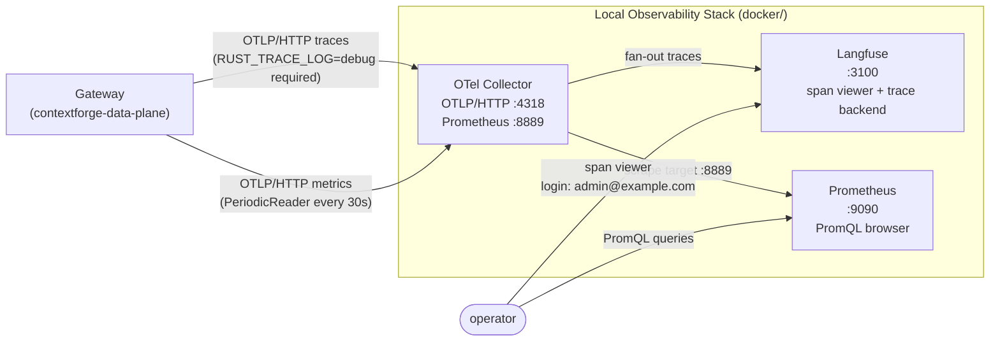
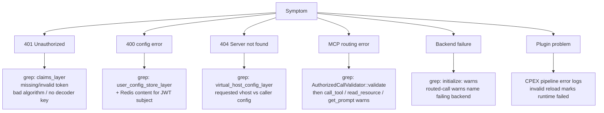

# Configuration Reference

## Minimum Required Flags

```text
--redis-address   --redis-port   --redis-mode
```

Plus at least: `--address` or `--tls-address`, `--token-verification-public-key` or `--token-verification-secret`.

## Complete CLI and Environment Reference

The binary parses both CLI flags and environment variables with `clap`; a CLI
flag wins when both forms are supplied. Use the binary for the always-current
generated reference:

```bash
cargo run -p contextforge-data-plane --bin contextforge-data-plane -- --help
```

Most environment variables use the `CONTEXTFORGE_DATA_PLANE_` prefix. The MCP
Origin and Host settings retain the explicitly configured
`CONTEXTFORGE_GATEWAY_RS_` names shown below.

### Listeners and JWT

| Flag | Environment variable | Default / requirement | Purpose |
| --- | --- | --- | --- |
| `--address <host:port>` | `CONTEXTFORGE_DATA_PLANE_ADDRESS` | Optional | Plain HTTP listener. |
| `--tls-address <host:port>` | `CONTEXTFORGE_DATA_PLANE_TLS_ADDRESS` | Optional | TLS listener; requires server certificate and key. |
| `--server-certificate <path>` | `CONTEXTFORGE_DATA_PLANE_TLS_SERVER_CERTIFICATE` | With `--tls-address` | PEM certificate chain for downstream TLS. |
| `--server-private-key <path>` | `CONTEXTFORGE_DATA_PLANE_TLS_SERVER_PRIVATE_KEY` | With `--tls-address` | PEM private key for downstream TLS. |
| `--token-verification-public-key <path>` | `CONTEXTFORGE_DATA_PLANE_TOKEN_VERIFICATION_PUBLIC_KEY` | For RSA tokens | Verifies `RS256`, `RS384`, and `RS512` tokens. |
| `--token-verification-secret <secret>` | `CONTEXTFORGE_DATA_PLANE_TOKEN_SECRET` | For HMAC tokens | Verifies `HS256`, `HS384`, and `HS512` tokens. |
| `--token-verification-private-key <path>` | `CONTEXTFORGE_DATA_PLANE_TOKEN_VERIFICATION_PRIVATE_KEY` | Required when built with `with_tools` | Signs tokens for the optional local bootstrap helper. |

### MCP request validation

| Flag | Environment variable | Default | Purpose |
| --- | --- | --- | --- |
| `--mcp-allowed-origins <origin,...>` | `CONTEXTFORGE_GATEWAY_RS_MCP_ALLOWED_ORIGINS` | None | Browser Origin allowlist. Without it, requests lacking `Origin` pass and every request carrying `Origin` receives HTTP `403`. |
| `--mcp-allowed-hosts <authority,...>` | `CONTEXTFORGE_GATEWAY_RS_MCP_ALLOWED_HOSTS` | None | Optional RMCP request-authority allowlist. For requests that reach the RMCP service, missing or malformed authorities receive HTTP `400`; unlisted authorities receive HTTP `403`. Earlier middleware may return first. |
| `--mcp-standard-header-max-count <n>` | `CONTEXTFORGE_DATA_PLANE_MCP_STANDARD_HEADER_MAX_COUNT` | `32` | Maximum MCP standard headers accepted on one request. |
| `--mcp-standard-header-max-value-bytes <n>` | `CONTEXTFORGE_DATA_PLANE_MCP_STANDARD_HEADER_MAX_VALUE_BYTES` | `8192` | Maximum byte length accepted for one MCP standard header value. |
| `--mcp-standard-header-max-total-bytes <n>` | `CONTEXTFORGE_DATA_PLANE_MCP_STANDARD_HEADER_MAX_TOTAL_BYTES` | `65536` | Approximate request-level aggregate bytes across all matched MCP standard header names and values. |

Values are comma-separated. Origin entries must be fully qualified serialized
origins such as `https://app.example.com`; Host entries are authorities such as
`gateway.example.com` or `gateway.example.com:8443`. See [Security](security.md#mcp-origin-and-host-validation).
The MCP standard header limits apply to `Mcp-Method`, `Mcp-Name`,
`Mcp-Protocol-Version`, and `Mcp-Param-*`. The same guardrail also covers the
legacy/RMCP transport header `Mcp-Session-Id`. A configured value of `0` is
treated as the documented default. The byte totals are application-level
aggregate budgets based on all matched header name and value lengths on one
request; they do not allow a single oversized value, which is still capped by
`--mcp-standard-header-max-value-bytes`. They are not exact wire-size accounting
and do not model HTTP/2 header compression. Non-MCP headers remain bounded by
the HTTP transport.

### Redis

| Flag | Environment variable | Default / requirement | Purpose |
| --- | --- | --- | --- |
| `--redis-address <host>` | `CONTEXTFORGE_DATA_PLANE_REDIS_HOSTNAME` | Required | Redis host name or IP. |
| `--redis-port <port>` | `CONTEXTFORGE_DATA_PLANE_REDIS_PORT` | Required | Redis port. |
| `--redis-mode <mode>` | `CONTEXTFORGE_DATA_PLANE_REDIS_CONNECTION_MODE` | Required | `plain-text`, `tls`, or `mtls`. |
| `--redis-tls-trust-bundle <path>` | `CONTEXTFORGE_DATA_PLANE_REDIS_TLS_REDIS_TRUST_BUNDLE` | TLS and mTLS | PEM trust bundle. |
| `--redis-tls-client-certificate <path>` | `CONTEXTFORGE_DATA_PLANE_REDIS_TLS_REDIS_CLIENT_CERTIFICATE` | mTLS | PEM client certificate. |
| `--redis-tls-client-private-key <path>` | `CONTEXTFORGE_DATA_PLANE_REDIS_TLS_REDIS_CLIENT_PRIVATE_KEY` | mTLS | PEM client private key. |
| `--user-config-cache-expiry-seconds <n>` | `CONTEXTFORGE_DATA_PLANE_USER_CONFIG_CACHE_EXPIRY_SECONDS` | `60` | In-process cache expiry; `0` reads Redis on every request. |

### Upstream connections

| Flag | Environment variable | Default / requirement | Purpose |
| --- | --- | --- | --- |
| `--upstream-connection-mode <mode>` | `CONTEXTFORGE_DATA_PLANE_UPSTREAM_CONNECTION_MODE` | `tls-only` | Permits HTTPS only, HTTP and HTTPS, or an mTLS mode. |
| `--upstream-trust-bundle <path>` | `CONTEXTFORGE_DATA_PLANE_TLS_UPSTREAM_TRUST_BUNDLE` | Optional | Additional PEM trust bundle for HTTPS backends. |
| `--upstream-certificate <path>` | `CONTEXTFORGE_DATA_PLANE_TLS_UPSTREAM_CERTIFICATE` | mTLS modes | PEM client certificate. |
| `--upstream-private-key <path>` | `CONTEXTFORGE_DATA_PLANE_TLS_UPSTREAM_PRIVATE_KEY` | mTLS modes | PEM client private key. |

### Runtime and plugins

| Flag | Environment variable | Default | Purpose |
| --- | --- | --- | --- |
| `--number-of-cpus <n>` | `CONTEXTFORGE_DATA_PLANE_NUMBER_OF_CPUS` | Host CPU count | Tokio worker/runtime thread count. |
| `--single-runtime <bool>` | `CONTEXTFORGE_DATA_PLANE_SINGLE_RUNTIME` | `true` | `false` creates per-CPU runtimes without session affinity. |
| `--runtime-plugins-enabled <bool>` | `CONTEXTFORGE_DATA_PLANE_RUNTIME_PLUGINS_ENABLED` | `false` | Enables compiled-in CPEX hooks and Redis plugin config loading. |

### Telemetry and logging

| Flag | Environment variable | Default | Purpose |
| --- | --- | --- | --- |
| `--enable-open-telemetry <bool>` | `CONTEXTFORGE_DATA_PLANE_ENABLE_OPEN_TELEMETRY` | `false` | Enables OTLP trace export. |
| `--enable-otel-metrics <bool>` | `CONTEXTFORGE_DATA_PLANE_ENABLE_OTEL_METRICS` | `false` | Enables OTLP HTTP-server metric export. |
| `--otlp-protocol <protocol>` | `CONTEXTFORGE_DATA_PLANE_OTEL_EXPORTER_OTLP_PROTOCOL` | `grpc` | `grpc` or `http-protobuf`. |
| `--otlp-endpoint <uri>` | `CONTEXTFORGE_DATA_PLANE_OTEL_EXPORTER_OTLP_ENDPOINT` | Protocol-specific | Trace endpoint; defaults to `http://127.0.0.1:4317` for gRPC or `http://127.0.0.1:4318/v1/traces` for HTTP. |
| `--otlp-metrics-endpoint <uri>` | `CONTEXTFORGE_DATA_PLANE_OTEL_EXPORTER_OTLP_METRICS_ENDPOINT` | Protocol-specific | Metrics endpoint; defaults to `http://127.0.0.1:4317` for gRPC or `http://127.0.0.1:4318/v1/metrics` for HTTP. |
| `--otlp-headers <headers>` | `CONTEXTFORGE_DATA_PLANE_OTEL_EXPORTER_OTLP_HEADERS` | None | Comma-separated `key=value` exporter headers. |
| `--otlp-service-name <name>` | `CONTEXTFORGE_DATA_PLANE_OTEL_SERVICE_NAME` | `CONTEXTFORGE-DATA-PLANE` | OpenTelemetry `service.name`. |
| `--log-name <name>` | `CONTEXTFORGE_DATA_PLANE_LOG_NAME` | `contextforge-data-plane.log` | File log name in the current directory. |
| `--log-rotation <mode>` | `CONTEXTFORGE_DATA_PLANE_LOG_ROTATION` | `hourly` | `minutely`, `hourly`, `daily`, or `never`. |

## JWT Claims (validated by `claims_layer`)

| Claim | Required value |
| --- | --- |
| `iss` | `mcpgateway` |
| `aud` | `mcpgateway-api` |
| `exp` | present, not expired |
| `sub` | → selects Redis user config key |

Optional: `token_use`, `iat`, `teams`, `scopes`, `user.full_name`.

> **No revocation:** a leaked token is valid until `exp`. Rotate the signing key and restart to invalidate all outstanding tokens.

## UserConfig Shape (from `contextforge-data-plane-apis`)

```text
UserConfig
  virtual_hosts: HashMap<String, VirtualHost>

VirtualHost
  backends: HashMap<String, BackendMCPGateway>   ← map key = routing prefix

BackendMCPGateway
  name: String
  url: Url
  passthrough_headers: Vec<String>                ← snapshotted at initialize; session-scoped
  add_headers: HashMap<String, String>            ← injected after passthrough
  remove_headers: Vec<String>                     ← stripped after add
  allowed_tool_names: Vec<String>                 ← model exists, NOT currently enforced
  tool_schemas: HashMap<String, JsonObject>        ← optional, defaults to {}; upstream name → input schema
  tool_name_aliases: HashMap<String, String>      ← downstream_alias → upstream_original
  allowed_resource_names: Vec<String>             ← model exists, NOT currently enforced
  allowed_prompt_names: Vec<String>               ← model exists, NOT currently enforced
```

`tool_schemas` lets the dataplane recognize and validate `x-mcp-header`
annotations without calling backend `tools/list`. The control plane may omit the
field or individual unannotated tools. Without a published schema, parameter
headers are forwarded as unrecognized intermediary headers and are not locally
validated. A published annotation must name a non-empty, case-insensitively
unique HTTP token on a `string`, `integer`, or `boolean` property reachable from
the schema root through `properties` keys only. Nested properties use their
exact property path. For a recognized annotation, a non-null argument requires
an equal header; an absent or null argument requires the header to be absent.
Integer values are limited to the IEEE 754 safe range.

**Header apply order:** `passthrough_headers` → `add_headers` (override passthrough) → `remove_headers` (applied last).

**`passthrough_headers` is session-scoped.** Values are snapshotted from the `initialize` request and baked into the backend transport for the session lifetime. Post-`initialize` calls (tool calls, list calls) reuse those headers. Request-scoped propagation requires per-request transport reconstruction (future work).

**Protected headers** — silently skipped in all three phases (passthrough/add/remove):

| Category | Headers |
| --- | --- |
| Body-framing | `Content-Length`, `Content-Type` |
| Hop-by-hop | `Connection`, `Keep-Alive`, `Proxy-Authenticate`, `Proxy-Authorization`, `Proxy-Connection`, `TE`, `Trailer`, `Trailers`, `Transfer-Encoding`, `Upgrade` |
| RMCP-reserved | `Mcp-Session-Id`, `Accept`, `Last-Event-Id` |
| Gateway-managed | `Host` (set from backend URL host + port; never overridden by config) |
| MCP standard | `Mcp-Method`, `Mcp-Name`, `Mcp-Protocol-Version`, `Mcp-Param-*` |

`Authorization` and `Cookie` are not protected here because backend
authentication through `passthrough_headers` or `add_headers` is intentional
runtime configuration.

Redis storage: `MessagePack(User::new(sub))` → `MessagePack(UserConfig)`.

Two schemas are generated — both must be regenerated and committed when `UserConfig`, `VirtualHost`, `BackendMCPGateway`, or the `User` key type changes:

| Schema file | Covers |
| --- | --- |
| `schemas/user_config.json` | `UserConfig` routing document written to Redis. |
| `schemas/user.json` | `User` key type used as the Redis key. |

```bash
cargo run -p contextforge-data-plane-apis
```

## Plugin Config (Redis key: `ContextForgeGatewayRuntimePluginConfig`)

```text
RuntimePluginConfigDocument
  version: 1
  cpex: CpexConfig
```

Supported: tool, prompt, and resource pre/post CMF hooks.
Rejected: routing-based selection, plugin dirs, global policies, LLM hooks, plugin conditions.
Config validation and `CmfPluginFactory` registration must agree on that list: a hook accepted by validation but not registered leaves the plugin loaded and silently inert.
Reload watcher: 10-minute interval. Invalid reload → runtime marked failed.

### Tool Call Hook Behavior

For `call_tool`, the pre hook runs after backend routing has selected the backend and stripped the public prefix. The hook sees the backend name, routed tool name, and arguments. It can leave arguments unchanged, replace arguments, or deny the call.

After the upstream backend returns, the post hook can leave the result unchanged, rewrite the result payload, or deny the response. Hook state is carried across the upstream call so pre and post hooks can share CPEX context for the same logical tool call.

Plugin execution must not poison shared gateway state. A plugin denial becomes an MCP error. Soft plugin errors are logged. Unsupported plugin configuration fails validation before the runtime is accepted.

### Prompt Fetch Hook Behavior

For `get_prompt`, the pre hook runs after backend routing, so the plugin sees the backend-local prompt name and the owning backend separately rather than the gateway-prefixed identifier. It can leave the arguments unchanged, replace them, or deny the fetch before the backend renders anything.

The post hook receives the rendered prompt as one CMF message per rendered MCP message, each carrying its role and its content block: text, image, audio, embedded resource, or resource link. A plugin can inspect or rewrite any of them, so a policy can act on a file interpolated into a prompt rather than only on the surrounding text.

Writing plugin edits back follows three rules:

- A message the plugin left unchanged is returned exactly as the backend sent it, so annotations, `_meta`, and binary resource blobs survive untouched.
- A message the plugin changed is rebuilt from CMF. CMF does not model MCP annotations or `_meta`, so an edited message loses them.
- Edits that cannot be applied faithfully fail the call rather than falling back to the backend's original. A changed message count, anything other than exactly one prompt result in the payload, a role MCP prompts cannot express, or a resource whose text the plugin removed all return an error. Silently restoring the backend's content would undo a redaction.

MCP prompt results carry no error flag, so a plugin setting `is_error` on the CMF prompt result is rejecting the prompt rather than describing it. The gateway turns that into an MCP error carrying the plugin's `error_message`, and the rendered content never reaches the client. This differs from tools, where `is_error` is a field on `CallToolResult` and is forwarded as a successful response.

Binary resources embedded in prompts reach plugins by URI and MIME type but not by content. A plugin can deny such a message; editing one fails the write-back. Resource-read hooks below have their own binary conversion.

### Resource Read Hook Behavior

For `resources/read`, the pre hook receives the canonical backend-local URI and may allow, deny or rewrite it. A rewritten URI must resolve unambiguously through the caller's published virtual-host resources before a backend connection is opened. Aliases for the same backend target do not create ambiguity.

The post hook may replace each returned resource's text or binary content, URI and MIME type, including converting text to a blob or a blob to text. Existing MCP `_meta` is preserved. CMF-only envelope and descriptive fields do not restrict these changes. Each resource still needs a valid MCP content representation; binary resource reads are decoded for CPEX and re-encoded after edits, while unchanged blob bytes retain their original wire value. This resource path does not add prompt-wide payload validation.

The pre call returns an opaque, concrete `ResourceHookState` consumed by the post call. It captures both the runtime and the decision to run or skip post hooks before backend I/O. A reload only affects subsequent requests, including when it enables or disables resource hooks. Callers cannot construct missing or mismatched active state, and requests without a post hook allocate no correlation state.

### Demo Plugin Workflow

The optional `test-plugins` feature compiles demo factories from the `cpex-plugins-rs` repository. Redis configuration activates factories already present in the binary; it never loads new Rust code into a running process.

Start lightweight dependencies:

```bash
docker compose -f docker/docker-compose-local.yaml up -d redis gateway-one gateway-two
```

Register payload-marker configuration before starting the ContextForge external dataplane:

```bash
docker compose -f docker/docker-compose-local.yaml exec -T redis \
  redis-cli SET ContextForgeGatewayRuntimePluginConfig '{
    "version": 1,
    "cpex": {
      "plugins": [
        {
          "name": "payload-marker",
          "kind": "contextforge/payload-marker",
          "hooks": ["cmf.tool_post_invoke"]
        }
      ]
    }
  }'
```

Build and run with demo factories and runtime execution enabled:

```bash
cargo run -p contextforge-data-plane \
  --features 'contextforge-data-plane-lib/with_tools,test-plugins' \
  --bin contextforge-data-plane -- \
  --address 127.0.0.1:8001 \
  --redis-address 127.0.0.1 \
  --redis-port 6379 \
  --redis-mode plain-text \
  --token-verification-public-key assets/jwt.key.pub \
  --token-verification-private-key assets/jwt.key \
  --upstream-connection-mode plain-text-or-tls \
  --runtime-plugins-enabled true
```

Startup should log successful CPEX initialization. The payload marker appends `[cpex:payload-marker]` to successful tool results. The hook path is also covered by:

```bash
cargo nextest run --locked -p contextforge-data-plane-lib --test gateway_plugins
```

## Startup Validation (fails fast)

| Invalid combo | Reason |
| --- | --- |
| `--tls-address` without cert or key | Rustls needs both |
| Same address for `--address` and `--tls-address` | Cannot bind same socket twice |
| `--redis-mode tls` without trust bundle | Required |
| `--redis-mode mtls` without trust bundle + client cert + key | All three required |
| mTLS upstream without cert and key | reqwest identity cannot be built |
| HTTP backend URL with default upstream mode (HTTPS-only) | Calls fail before reaching backend |

## Upstream Connection Modes

| Mode | Behavior |
| --- | --- |
| omitted / `tls-only` | HTTPS backends only (safe default) |
| `plain-text-or-tls` | HTTP or HTTPS (use for local Compose backends) |
| `plain-text-or-m-tls` | HTTP or HTTPS + client identity |
| `mtls-only` | HTTPS + client cert/key required |

## Logging Env Vars

| Var | Default | Controls |
| --- | --- | --- |
| `RUST_LOG` | `debug` | Console filter |
| `RUST_FILE_LOG` | `debug` | File filter |
| `RUST_TRACE_LOG` | `info` | OTLP span filter (`debug` for local trace verification) |


## Telemetry Debugging Notes

> **`RUST_TRACE_LOG=debug` is required for trace export.** The default (`info`) drops HTTP spans before they reach the OTLP exporter — nothing arrives at the trace backend.

Metrics are pushed by a `PeriodicReader` every **30 seconds**. Allow ~35s after the first request before data appears downstream.

**Stable log prefixes for grepping** (use these to scope log searches by boundary):

| Prefix | Boundary |
| --- | --- |
| `claims_layer` | JWT validation failures |
| `user_config_store_layer` | Config lookup / Redis errors |
| `virtual_host_config_layer` | Unknown virtual host |
| `AuthorizedCallValidator::validate` | Post-session MCP validation |
| `initialize:` | Backend session creation |
| `call_tool` | Tool routing and backend invocation |

**Debugging by symptom:**

| Symptom | Where to look |
| --- | --- |
| `401` | `claims_layer` logs: missing/invalid token, unsupported algorithm, no decoder key |
| `400` config error | `user_config_store_layer` logs + Redis content for the JWT subject |
| `404 Server not found` | `virtual_host_config_layer` debug: requested vhost id vs caller's config |
| MCP routing errors | `AuthorizedCallValidator::validate` debug, then `call_tool`/`read_resource`/`get_prompt` warns |
| Backend failures | `initialize:` warns for failed backends; routed-call warns name the failing backend |
| Plugin problems | CPEX pipeline error logs; invalid reload marks runtime failed |

## Local Telemetry Verification Stack

A complete local observability pipeline ships under `docker/` as overlays:

| Component | Role | Endpoint |
| --- | --- | --- |
| Langfuse | Trace backend and span viewer. | `http://localhost:3100`, login `admin@example.com` / `changeme`, project `ContextForge Data Plane`. |
| OTel Collector | Receives OTLP from the gateway; fans traces and metrics out. | OTLP/HTTP on `:4318`, Prometheus exposition on `:8889`. |
| Prometheus | Scrapes the collector for browsable PromQL. | `http://localhost:9090`. |



**Debugging by symptom:**




Start:
```bash
docker compose \
  -f docker/docker-compose-local.yaml \
  -f docker/docker-compose-langfuse.yaml \
  -f docker/docker-compose-otel-collector.yaml \
  up -d
```

Run the gateway with export enabled (RUST_TRACE_LOG=debug required for trace export):
```bash
RUST_TRACE_LOG=debug \
cargo run --release --bin contextforge-data-plane -- \
  --address 0.0.0.0:8001 \
  --redis-port 6379 --redis-address 127.0.0.1 --redis-mode=plain-text \
  --token-verification-public-key assets/jwt.key.pub \
  --number-of-cpus 4 \
  --upstream-connection-mode=plain-text-or-tls \
  --enable-open-telemetry true \
  --enable-otel-metrics true \
  --otlp-protocol http-protobuf \
  --otlp-endpoint  http://127.0.0.1:3100/api/public/otel/v1/traces \
  --otlp-metrics-endpoint http://127.0.0.1:4318/v1/metrics \
  --otlp-service-name contextforge-data-plane
```

## Prometheus Starter Queries

| Question | Query |
| --- | --- |
| Request count by method, status, service | `http_server_request_duration_seconds_count` |
| p95 latency | `histogram_quantile(0.95, sum by (le) (rate(http_server_request_duration_seconds_bucket[1m])))` |
| In-flight requests | `http_server_active_requests` |
| Payload throughput | `http_server_request_body_size_bytes_sum` / `http_server_response_body_size_bytes_sum` |

## Known Telemetry Gaps

Tracked upstream, not yet implemented in the ContextForge external dataplane:

| Gap | Issue |
| --- | --- |
| W3C trace-context propagation across gateway hops | [mcp-context-forge#4723](https://github.com/IBM/mcp-context-forge/issues/4723) |
| MCP-semantic spans with tool names and JSON-RPC method attributes | [mcp-context-forge#4722](https://github.com/IBM/mcp-context-forge/issues/4722) |
