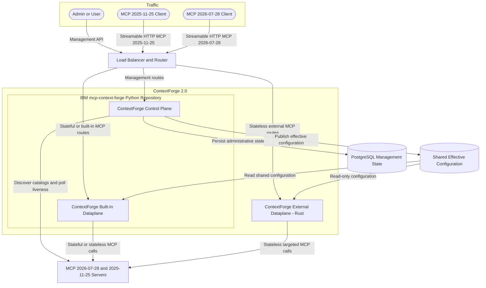
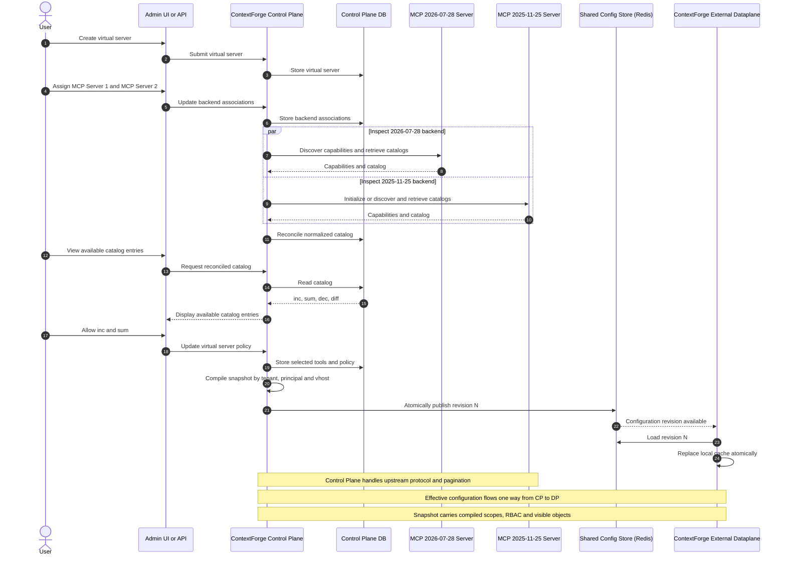
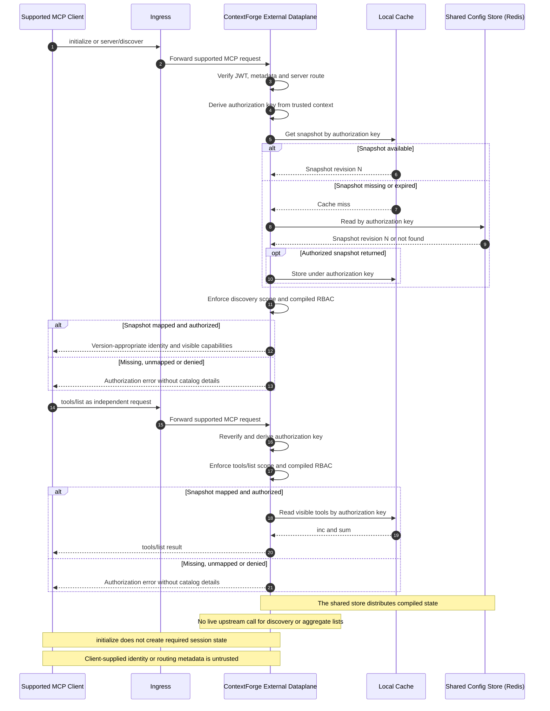
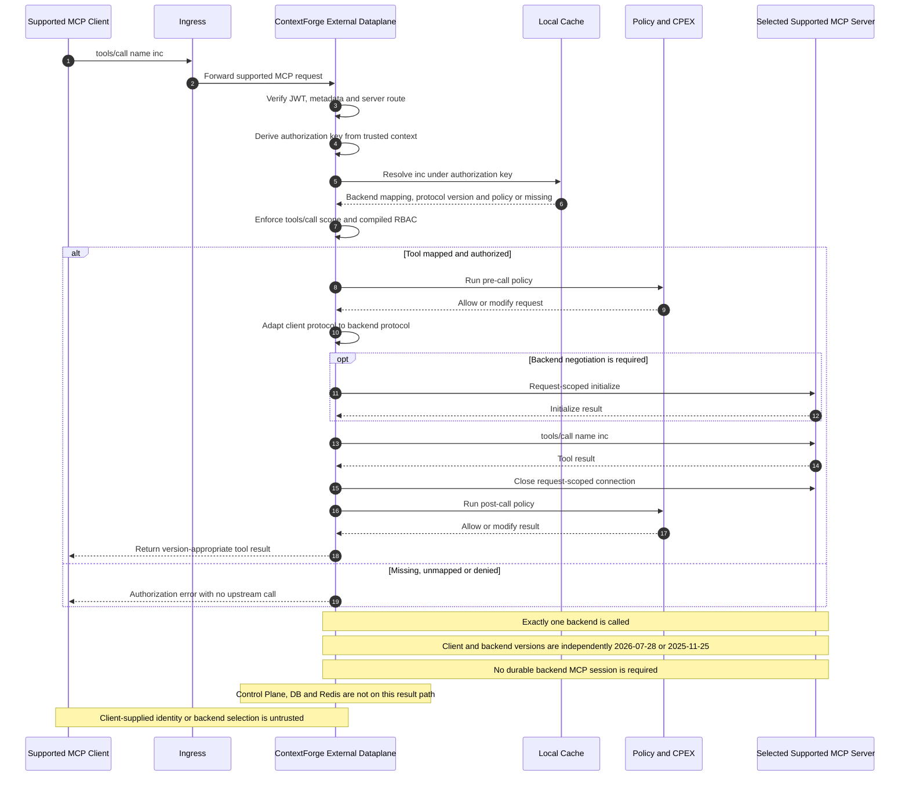
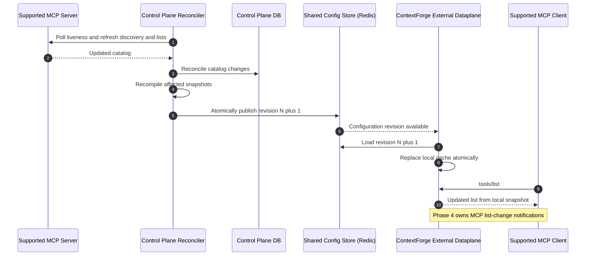

# ContextForge 2.0 Target Architecture and Roadmap

> **Tentative target:** this page records the proposed ContextForge 2.0 end
> state and delivery phases. It is not a description of the current Rust
> implementation. See [Architecture](architecture.md) and
> [MCP Routing Semantics](routing.md) for current behavior.

This is a product-wide view because the ContextForge external dataplane
boundary depends on work owned by the ContextForge control plane and built-in
dataplane in the Python `IBM/mcp-context-forge` repository. It does not move
control-plane or built-in-dataplane responsibilities into this repository. See
[Project terminology](project.md#terminology) for the canonical component
names.

## Vision and Constraints

- ContextForge supports MCP `2026-07-28` and `2025-11-25` over Streamable HTTP
  on both the client-facing and backend-facing sides of the ContextForge
  external dataplane.
- Same-version client/backend paths are supported directly. Cross-version
  `2026-07-28` → `2025-11-25` and `2025-11-25` → `2026-07-28` adaptation is
  best effort.
- All external-dataplane request/response handling is stateless for both
  versions. The target request path does not depend on an MCP session, session
  affinity, or a retained backend transport.
- `initialize` remains supported for compatibility, but it is a stateless
  request: the external dataplane generates its response from effective
  configuration and does not use it to establish state required by later
  requests.
- Legacy SSE transport is not part of the external-dataplane target.
- Fan-out and other one-to-many MCP work is limited to the control plane. The
  built-in and external dataplanes generate discovery, capability, and list
  responses from control-plane-authored effective configuration.
- Effective configuration flows one way from the control plane to the built-in
  and external dataplanes through externally shared state. A process-local
  cache may speed reads but is never the source of truth.
- MCP subscriptions and notifications remain Phase 4 work.

## Stateless Protocol Compatibility

[IBM/mcp-context-forge issue #6327](https://github.com/IBM/mcp-context-forge/issues/6327)
tracks the first targeted-operation slice for `tools/call`. The issue calls the
incoming/client-facing side “upstream” and the selected backend-facing side
“downstream”; this wiki uses the explicit names below.

| Incoming client | Selected backend | Target behavior |
| --- | --- | --- |
| `2026-07-28` | `2026-07-28` | Supported directly as one stateless request. |
| `2026-07-28` | `2025-11-25` | Best-effort protocol adaptation within one stateless request. |
| `2025-11-25` | `2026-07-28` | Best-effort protocol adaptation within one stateless request. |
| `2025-11-25` | `2025-11-25` | Supported directly as one stateless request. |

For every row, the external dataplane authenticates and authorizes the request, reads
the principal-bound effective configuration, validates that the requested
object is visible and permitted, resolves exactly one backend, adapts the
protocol when necessary, and closes the request-scoped backend connection after
the response. A client may call `initialize`, but later operations neither
require nor reuse state created by it.

“Best effort” never permits hidden session state. If a semantic difference or
backend requirement cannot be handled within the current request, the
external dataplane returns an explicit error instead of creating affinity or
retaining a backend transport for a later request.

For the initial `tools/call` slice, issue #6327 assumes that the selected
backend needs neither application authentication nor mTLS and that its server
certificate chains to the system CA. Those are issue-scope assumptions, not a
change to the external dataplane's broader transport-security model.

## Target End State

The front door separates management traffic from MCP traffic and chooses the
built-in or external dataplane by deployment route and session model, not only
by protocol version. The built-in dataplane can handle either supported version in stateful
or stateless mode. The external dataplane can handle either supported version
only in stateless mode. PostgreSQL remains the durable management store; the
shared runtime store carries compiled configuration to both dataplanes.

Redis is the current external-dataplane configuration store and the preferred
shared implementation. The built-in dataplane may consume the same compiled
configuration from Redis or PostgreSQL. When multiple built-in-dataplane
instances are deployed, stateful MCP behavior requires an explicit shared-state
or affinity design; stateless behavior must not rely on process memory.

## Component Responsibilities

| Component | Target responsibility |
| --- | --- |
| Front door | Route management APIs to the ContextForge control plane. Route MCP to the built-in dataplane when the built-in route or stateful behavior is required, and to the external dataplane when the configured stateless external route is selected. Protocol version alone does not identify the component. |
| ContextForge control plane | Manage the virtual-server lifecycle and upstream assignments; connect to heterogeneous upstreams; retrieve and page through capabilities, tools, resources, prompts, completions, and other catalogs; normalize and persist them; let administrators select exposed objects and rules; compile effective runtime configuration; poll upstream liveness and changes. |
| PostgreSQL | Persist administrative source data such as virtual servers, upstream definitions, normalized catalogs, selections, and policies. It is not on the external-dataplane request path. |
| Configuration synchronization | Publish effective configuration one way from the control plane to externally shared state. The built-in and external dataplanes should consume the same shape where practical. |
| ContextForge built-in dataplane | Handle `2026-07-28` and `2025-11-25` MCP requests in Python, including stateful and stateless behavior. It is the MCP request path shipped in the same repository as the control plane, not the control plane itself. |
| ContextForge external dataplane | Handle `2026-07-28` and `2025-11-25` Streamable HTTP requests statelessly in Rust. Read effective configuration, serve aggregate and `initialize` responses locally, and route a targeted method to exactly one selected backend. Cross-version adaptation is best effort. It does not own IAM, UI, management APIs, or durable metrics storage. |
| Backend MCP servers | May use `2026-07-28` or `2025-11-25`, independently of the incoming client version. Connections and any required negotiation are request-scoped and leave no reusable session; the architecture does not require backend session affinity. |

## Administrative State and Effective Configuration

The control plane owns two distinct forms of state:

| State | Contents | Owner and consumers |
| --- | --- | --- |
| Administrative source state | Virtual servers, upstream registrations, raw and normalized catalogs, exposure selections, policies, and liveness. | Written by the control plane to PostgreSQL; used by management workflows and reconciliation. |
| Effective runtime configuration | Effective server identity and capabilities, visible tools/resources/prompts/completions, downstream paging material, backend resolution, required scopes/roles, and applicable runtime policy for a tenant or isolation domain, user, team, or other principal. | Compiled and published by the control plane; read by the built-in and external dataplanes. |

The control plane must exhaust upstream pagination while reconciling catalogs.
The compiled snapshot must contain enough information for either the built-in
or external dataplane to produce downstream paging without contacting every
upstream. Publication must be atomic or revisioned so neither the built-in nor
external dataplane combines partial catalog and policy state.

## Target Authorization Invariants

The effective-configuration model requires identity isolation as well as
catalog precomputation. A cached snapshot is data, not an authorization grant.
Every downstream request must independently establish and enforce its trusted
authorization context.

- The external dataplane derives the authorization key only from verified JWT
  claims and the validated server route. MCP params and client metadata must not
  supply or override a principal, team, tenant, virtual server, backend, or
  cache key.
- Snapshot and cache partitions include the applicable trust or tenant
  boundary, authenticated `sub`, effective team or other principal, virtual
  server, and configuration revision. Entries must never be reused across
  authorization contexts.
- The control plane maps verified identity attributes to an effective
  principal and compiles its visible objects and RBAC policy. The built-in and
  external dataplanes enforce required token scopes or roles and the compiled
  policy on every discovery, list, and targeted operation.
- Missing, unmapped, ambiguous, expired, or unauthorized snapshots and objects
  are denied by default. A targeted denial makes no upstream call, and errors
  must not disclose another principal's catalog or backend mapping.
- The exact tenant/team claim mapping and token-scope-to-RBAC rules are a
  cross-repository contract that the control plane, publisher, schemas,
  external dataplane, and integration tests must define together. The current
  coarse `sub`-only implementation is not the Phase 3 target.

## MCP Work Allocation

| Work | Target owner and behavior |
| --- | --- |
| Virtual-server creation and upstream assignment | Control plane persists management state and connects to assigned upstreams. |
| Upstream discovery, initialization where required, catalog pagination, capability aggregation, filtering, and liveness polling | Control plane only; this is the intentional fan-out boundary. |
| `server/discover`, `initialize`, and effective capabilities | After per-request authorization, the built-in or external dataplane generates the response from principal-bound effective configuration. The built-in dataplane may support a stateful flow; the external dataplane treats `initialize` as stateless compatibility and creates no state required by later requests. |
| `tools/list`, `resources/list`, `prompts/list`, resource-template listing, and similar aggregate methods | After method-scope and compiled-RBAC enforcement, the built-in or external dataplane generates the visible response from principal-bound effective configuration with no live upstream fan-out. |
| `tools/call`, `resources/read`, `prompts/get`, completion, and similar targeted methods | The built-in or external dataplane resolves the effective entry under the trusted authorization key, applies default-deny scope and object policy, and calls exactly one selected backend only when authorized. The external dataplane adapts protocol versions when necessary and leaves no reusable session; the built-in dataplane may use its stateful or stateless execution model. |
| Plugins for trusted aggregate responses | Prefer policy compiled by the control plane; avoid mandatory per-request plugin calls for a response already produced from trusted effective configuration. |
| Plugins for targeted calls | May run on the external-dataplane request path when request or response inspection is required. Exact hook allocation remains an implementation decision. |
| Subscriptions, server notifications, and downstream list-change notifications | Deferred to Phase 4 because their state and delivery model do not fit the request/response simplification. |

## Delivery Roadmap

| Phase | Scope |
| --- | --- |
| **1. Separate control-plane and built-in-dataplane responsibilities** | Establish a clear boundary between the ContextForge control plane and built-in dataplane inside the Python repository. The control plane writes effective configuration per user, team, or other principal to shared state; the built-in dataplane reads it and handles MCP requests. |
| **2. Route targeted calls through the external dataplane** | Make the built-in and external dataplanes follow the same configuration-driven contract. Send selected targeted operations such as `tools/call`, `resources/read`, `prompts/get`, and completion to the external dataplane. For each operation, support both same-version `2026-07-28`/`2025-11-25` paths and attempt both cross-version paths on a best-effort basis, always without reusable session state. The `tools/call` slice is tracked by [#6327](https://github.com/IBM/mcp-context-forge/issues/6327). |
| **3. Route all stateless request/response MCP methods through the external dataplane** | Serve discovery, stateless `initialize`, capabilities, aggregate lists, and targeted calls for both supported protocol versions from the external dataplane. Aggregate responses come from effective configuration; targeted calls reach exactly one backend. The built-in dataplane continues to support both stateful and stateless behavior. |
| **4. Implement subscriptions and notifications** | Add the state, routing, and delivery model for upstream subscriptions, resource notifications, and list-change notifications after the request/response architecture is complete. |

## Phase 3 Reference Flows

The examples below use tools, but the same ownership applies to resources,
prompts, completions, and other aggregate or targeted request/response methods.
“Supported MCP client” and “supported MCP server” mean either `2026-07-28` or
`2025-11-25`; when the two sides differ, adaptation is best effort.

### 1. Create a Virtual Server and Select Capabilities

### 2. Initialize or Discover the Server and List Tools

### 3. Call a Tool

### 4. Reconcile an Upstream Catalog Change

