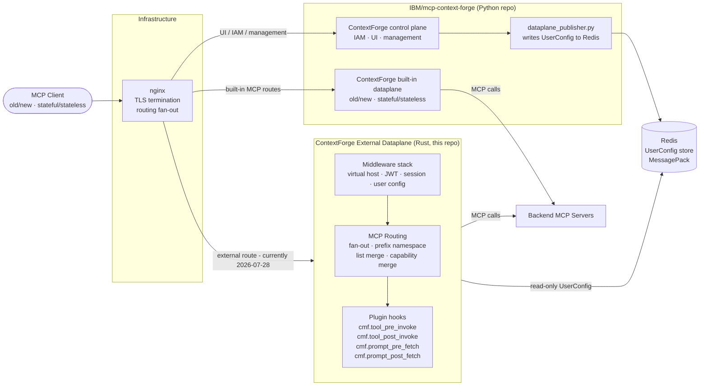
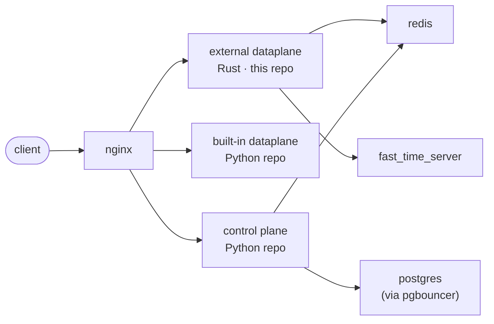

# Project Overview

> This page describes the **current implementation**. The tentative product
> end state and Phase 1-4 migration are documented in
> [ContextForge 2.0 Target Architecture and Roadmap](mcp-capability-allocation.md).

## What this project is

`contextforge-data-plane` is the Rust-based **ContextForge external dataplane**.
It is a scalable, separately deployable MCP (Model Context Protocol) gateway
that routes AI tool calls from MCP clients to backend MCP servers.

The [`IBM/mcp-context-forge`](https://github.com/IBM/mcp-context-forge)
Python repository contains two different product components: the ContextForge
control plane and the ContextForge built-in dataplane. This Rust repository is
the third component:

| Layer | Owns today |
| --- | --- |
| **ContextForge control plane** (Python) | IAM, UI, management APIs, durable administrative state, policy/catalog compilation, metrics storage, and external-dataplane configuration publishing. |
| **ContextForge built-in dataplane** (Python) | MCP request handling shipped in the same repository as the control plane. Supports `2026-07-28` and `2025-11-25`, including stateful and stateless behavior. |
| **ContextForge external dataplane** (Rust, this repo) | Separately deployed MCP request routing and authorization enforcement. The target supports both protocol versions without session state; cross-version adaptation is best effort. |

The ContextForge external dataplane must never take on control-plane concerns.

## Terminology

Use the full component names in product-wide architecture and deployment
documentation:

- **ContextForge control plane** means the Python management plane in
  `IBM/mcp-context-forge`. It owns administrative workflows and publishes
  effective runtime configuration; it is not the name for every process or MCP
  route in that repository.
- **ContextForge built-in dataplane** means the Python MCP request path in the
  same `IBM/mcp-context-forge` repository. “Built-in” describes where it ships,
  not a legacy-only or slow-path role. It handles the old and new protocol
  versions and can serve stateful or stateless clients.
- **ContextForge external dataplane** means this independently deployable Rust
  repository. “External” means external to the Python repository/deployment,
  not untrusted or third-party. Its target request path is stateless for both
  supported protocol versions.
- **Stateful** means later MCP requests can depend on session context established
  by `initialize` or a session identifier. **Stateless** means every request is
  independently authenticated, authorized, resolved, and completed without
  reusable MCP session state.

Always use one of the three canonical names. Do not use unqualified
“dataplane,” “local dataplane,” “slow dataplane,” or “fast dataplane” as a
product component name.




## Goals and objectives

- Provide a **production-grade, low-latency routing layer** between MCP clients and backend MCP servers.
- Support MCP `2026-07-28` and `2025-11-25` over Streamable HTTP as stateless downstream contracts.
- Enforce a clean **ContextForge external dataplane/control plane boundary** — no IAM, UI, or metrics storage logic in this repo.
- Keep config access behind the **`UserConfigStore` abstraction** (backed by Redis/MessagePack).
- Remain in the right architectural shape during early development, prioritising correctness over backward compatibility.

## Key stakeholders and users

- **Platform teams** — deploy and operate the gateway as infrastructure.
- **AI application developers** — use the gateway as the MCP proxy layer for their applications.
- **Internal contributors** — engineers evolving the ContextForge external dataplane toward stateless `2026-07-28` and `2025-11-25` protocol support.

## Key modules and architecture

Architecture context lives in the wiki. Key pages:

| Wiki page | Covers |
| --- | --- |
| [architecture.md](architecture.md) | Crate layout, pipeline shape, state ownership, module boundaries |
| [routing.md](routing.md) | Backend prefix namespace, routing contract, session state, method reference |
| [mcp-capability-allocation.md](mcp-capability-allocation.md) | Tentative ContextForge 2.0 end state, responsibility allocation, and Phase 1-4 roadmap |
| [config.md](config.md) | JWT validation, config keying, UserConfig shape, cache behavior |
| [security.md](security.md) | Trust boundaries, invariants, and tradeoffs |

## Crate ownership

| Crate | Purpose |
| --- | --- |
| `contextforge-data-plane-lib` | All ContextForge external-dataplane behavior: routing, middleware, sessions, transports. Almost everything goes here. |
| `contextforge-data-plane` (binary) | Process shell only: CLI flags, logging, runtime shape. No ContextForge external-dataplane logic. |
| `contextforge-data-plane-apis` | Shared config shapes (`UserConfig`, `User`, plugin config). Regenerate JSON schemas after any change: `cargo run -p contextforge-data-plane-apis`. |
| `contextforge-data-plane-cpex` | Plugin integration (CPEX hook factories). |
| `contextforge-load-test` | Performance harness: end-to-end MCP traffic driver. |

**Key invariants:**
- Redis/config access goes through `UserConfigStore` only — never leak Redis details into routing code.
- The backend prefix naming contract must not change without updating merge logic, split logic, and tests.
- When behavior on the hot path changes, the matching wiki page must be updated in the same change.

## Active work (near-term)

- **Protocol migration**: support same-version `2026-07-28` and `2025-11-25` paths over Streamable HTTP, provide best-effort translation in either cross-version direction, and replace stateful session paths with request-scoped handling.
- Legacy SSE transport and session affinity are **being removed** from the ContextForge external dataplane. `initialize` is retained as a stateless compatibility request and must not create persistent external-dataplane or backend session state.
- Protocol-sensitive tests must cover the two direct and two best-effort cross-version combinations. Modern examples should continue to use `server/discover` and per-request client metadata; compatibility examples may use `initialize` without relying on later session reuse.

## ContextForge Integration Contract

> **Provisional.** No formal contract has been stipulated yet. This section documents the current de-facto integration surface with [IBM/mcp-context-forge](https://github.com/IBM/mcp-context-forge). Any row may change while the project is early; when a proper contract is agreed, update this section to track it.

| Agreement | Value today |
| --- | --- |
| Client-facing route | `/servers/{virtual_host_id}/mcp`. Front door rewrites modern MCP `2026-07-28` Streamable HTTP traffic to `/contextforge-rs/servers/{virtual_host_id}/mcp` on the ContextForge external dataplane. |
| Protocol compatibility | Today the external-dataplane route accepts MCP `2026-07-28`; the built-in dataplane handles `2026-07-28` and `2025-11-25`, including stateful and stateless behavior and legacy SSE compatibility. The external-dataplane target handles both supported Streamable HTTP versions statelessly, with cross-version adaptation on a best-effort basis. |
| Unknown virtual host | `404` with body `{"detail":"Server not found"}`, matching the control-plane response shape. |
| Token issuer and audience | `iss = mcpgateway`, `aud = mcpgateway-api`. |
| Claims shape | `sub`, `jti`, `iss`, `aud`, `exp`, and `user` required. `token_use`, `iat`, `teams`, `scopes`, and `user.full_name` optional. The ContextForge external dataplane routes on `sub` only. |
| User config Redis key | `MessagePack(User::new(jwt_subject))` — key type plus subject, not the raw subject string. |
| User config Redis value | `MessagePack(UserConfig)`. JSON schema at `schemas/user_config.json`. |
| User key Redis schema | `schemas/user.json`. |
| Plugin config key | `ContextForgeGatewayRuntimePluginConfig`, JSON or MessagePack, `version: 1` with a `cpex` section. |

**Coordination rule:** changing any row above is a cross-repo change. The external dataplane, the control-plane publisher (`dataplane_publisher.py`), and the `cf-integration` harness all need updating together.

Regenerate both schemas after any struct change to `UserConfig`, `VirtualHost`, `BackendMCPGateway`, or the `User` key type:
```bash
cargo run -p contextforge-data-plane-apis
```

## System topology (current)

All external traffic enters through **nginx**, which routes management traffic
to the control plane and MCP traffic to either the built-in or external
dataplane:



### How the control plane publishes config to the external dataplane

The control plane and external dataplane do **not** communicate over HTTP.
Config is exchanged exclusively through Redis:

1. The control plane runs **`dataplane_publisher.py`** — a publisher script that writes external-dataplane configuration (user config, backend definitions, etc.) into Redis.
2. The external dataplane reads that config from Redis via the **`UserConfigStore`** abstraction (MessagePack-encoded `UserConfig`).

This means:
- The external dataplane is a **pure reader** of Redis config. It never writes back to the control plane's Redis keys.
- The control plane is the **sole writer** of external-dataplane config; the external dataplane has no direct dependency on the control-plane process at runtime.
- Config changes from the control plane are picked up by the external dataplane through normal cache refresh / Redis reads — no restart or direct RPC required.

### Per-component responsibilities

| Component | Role | Persistence |
| --- | --- | --- |
| **nginx** | TLS termination, routing fan-out | — |
| **ContextForge external dataplane** (`contextforge-data-plane`) | MCP routing, auth enforcement, and backend calls; current session-backed paths are migration state, while the target is stateless | Redis (read-only for config) |
| **ContextForge built-in dataplane** (`IBM/mcp-context-forge`) | Python MCP request handling for old/new protocols and stateful/stateless clients | Python repository runtime state and stores |
| **ContextForge control plane** (`IBM/mcp-context-forge`) | IAM, UI, management APIs, metrics, and external-dataplane config publishing | Redis (write) + PostgreSQL (via pgbouncer) |
| **redis** | Runtime config store, inter-component pub/sub channel | In-memory + persistence |
| **postgres** (via pgbouncer) | Control-plane relational store | Durable |
| **fast_time_server** | High-resolution time source used by the ContextForge external dataplane | — |

## External dependencies and integration points

- **Redis** — runtime config store (MessagePack-encoded `UserConfig`). Populated by `dataplane_publisher.py` on the control plane; read by the external dataplane via `UserConfigStore`.
- **ContextForge control plane** (`IBM/mcp-context-forge`) — owns management workflows and publishes external-dataplane config via `dataplane_publisher.py`.
- **ContextForge built-in dataplane** (`IBM/mcp-context-forge`) — owns the Python repository's MCP request paths, including old/new and stateful/stateless handling. Requests sent there do not route through the external dataplane.
- **fast_time_server** — high-resolution time source consumed by the ContextForge external dataplane.
- **Tokio + Axum** — fixed async runtime and web framework.
